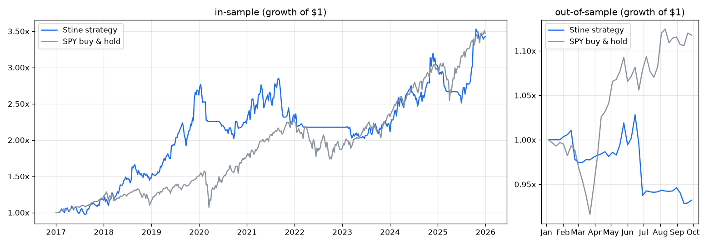

# Jesse Stine superstock strategy — weekly backtest

Price/volume rules from *Insider Buy Superstocks*, tested on weekly bars
(see `stine.py` for the exact rules).

- **In-sample:** 2017-01-01 → 2025-12-31, where 18 settings are tried and the best Sharpe (with at least 20 trades) is kept.
- **Out-of-sample:** 2026-01-01 → 2026-10-02, a single run with the in-sample winner.
- **Data:** Yahoo Finance daily bars adjusted for splits and dividends, rolled up into weekly bars.
- **Universe:** 169 of the 181 stocks in `universe.txt`.
- **Costs:** 0.25% per side; fills at the next week's open.

Run: `python run.py --download` (or `python run.py` once `data/` exists).

## Chosen settings (in-sample)

| Setting | Value |
|---|---|
| Base length | 52 weeks |
| Breakout volume | ≥ 3× the 10-week average |
| Sell into strength | more than 80% above the 30-week average |

## Results

| | Strategy IS | SPY IS | Strategy OOS | SPY OOS |
|---|---|---|---|---|
| Total return | +242.7% | +247.3% | −6.8% | +11.8% |
| CAGR | 14.7% | ~14.9% | – | – |
| Max drawdown | −29.3% | −31.8% | −9.7% | −8.4% |
| Sharpe (weekly) | 0.79 | 0.88 | −0.87 | 1.29 |
| Trades | 84 | – | 6 | – |
| Win rate (closed trades) | 37% | – | 25% (1 of 4) | – |
| Profit factor | 2.65 | – | 0.30 | – |
| Time invested | 83% | 100% | 90% | 100% |

### Calendar years (in-sample)

| Year | Strategy | SPY |
|---|---|---|
| 2017 | +18.6% | +21.7% |
| 2018 | +24.4% | −3.6% |
| 2019 | +77.6% | +30.2% |
| 2020 | −14.9% | +18.1% |
| 2021 | +5.3% | +28.7% |
| 2022 | −7.4% | −18.2% |
| 2023 | +1.6% | +26.2% |
| 2024 | +36.8% | +26.1% |
| 2025 | +13.3% | +16.8% |

## Caveats

- **Insider buying, float, short interest and sentiment are not modelled.** These are the heart of Stine's method.
- **The results are biased towards survivors.** The universe was chosen in 2026, Yahoo has no data for delisted stocks, and 12 tickers (mostly companies bought out or bankrupt) had no data.
- **The settings search is small** (18 combinations), but the in-sample result is still the best of 18; nearby settings gave a Sharpe ratio of 0.52–0.79.
- **The out-of-sample test is short:** 9 months and 6 trades, which is statistically thin.
- **The final week is partial:** the 2026-09-28 bar runs only to 2026-10-02.
